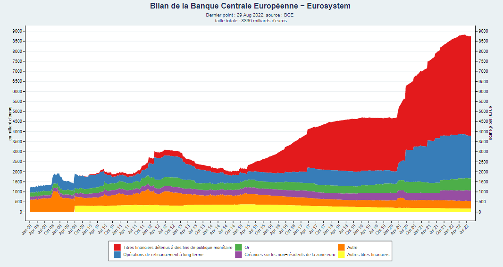

# financial_market_report

This repo contains a library of plot regarding inflation, monetary policy, exchange and interest rates and labor market. All plots are then concatenated in a single pdf report.


```{r}
# make report
rmarkdown::render("cahier_FI.Rmd")

```


